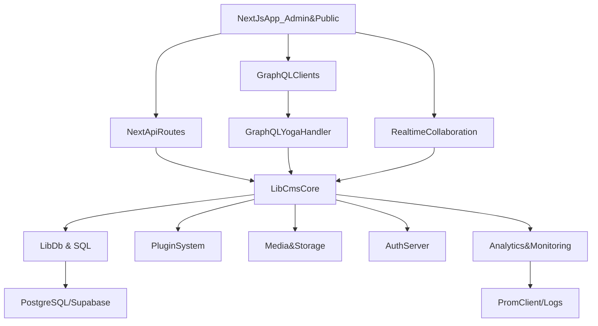

## Overview

**Project**: Emscale / Intellectt CMS – enterprise-grade, self‑hosted, headless CMS built on **Next.js 15 App Router**, **React 18**, **TypeScript**, **PostgreSQL (via `pg` Pool)**, **Supabase‑friendly connection patterns**, and a **schema‑driven CMS core**.

- **Frontend / Admin UI**: Next.js App Router under `app/` with a Sanity‑style admin dashboard at `/admin`.
- **APIs**: RESTful JSON APIs under `app/api/**` plus a full **GraphQL Yoga** server (`app/api/graphql`) exposing rich types and workflows.
- **CMS Core**: Business logic in `lib/cms/**`, `lib/auth/**`, `lib/security/**`, `lib/workflows/**`, `lib/analytics/**`, `lib/media/**`, `lib/realtime/**`, and `lib/plugins/**`.
- **Data Layer**: PostgreSQL via `lib/db.ts` plus higher‑level repositories/services in `lib/cms/api.ts` and related modules; numerous `.sql` migration and fixup scripts at repo root and under `scripts/`.
- **Auth**: Custom NextAuth‑style server helpers in `lib/auth/server.ts`, REST auth routes in `app/api/auth/**`, and UI components under `components/auth/**`.
- **Infrastructure / Ops**: `Dockerfile`, `docker-compose.yml`, `server.js`, `middleware.ts`, `deploy/`, `vercel.json`, `docs/**`, and `supabase/**`.

This file is optimized for **Cursor/AI usage**: it maps every important directory and file, documents conventions, and explains how pieces fit together so future AI sessions don’t need to rediscover the project.

---

## Architecture

At a high level the system is a **single Next.js 15 application** that embeds:

- A **public blog** (`app/blog/**`) backed by the CMS content tables.
- A full **admin dashboard** (`app/admin/**`) for managing content types (blog, news, case studies, ebooks, categories, leads, media, team, jobs, users).
- A **REST API surface** under `app/api/**` exposing CRUD + workflow actions for all CMS entities, including scheduled publishing and file downloads.
- A **GraphQL API** (`app/api/graphql`) that exposes higher‑level, typed access for external consumers.
- A **realtime collaboration and analytics layer** (Socket.IO, Web Vitals, custom analytics service).
- A **plugin system** that enables optional capabilities like audit log, content scheduling, analytics, media library, SEO, and A/B testing.

High‑level component diagram:

Key architectural points:

- **App Router**: `app/layout.tsx` wraps the entire app with fonts, `WebVitalsProvider`, and `ToastProvider`. `app/page.tsx` redirects to `/admin`, making the admin the primary entry.
- **Routing**:
  - **Admin pages**: under `app/admin/**` (list/detail/new/edit/preview pages for each content type).
  - **Auth pages**: under `app/auth/**` (login, register, forgot/reset password, OAuth callback).
  - **Public blog**: `app/blog/page.tsx` and `app/blog/[slug]/page.tsx`.
  - **API routes**: Next.js `route.ts` handlers under `app/api/**`.
  - **Error boundaries**: `app/error.tsx`, `app/global-error.tsx`, `app/not-found.tsx`, plus admin‑specific `app/admin/error.tsx`.
- **Data flow**:
  - UI (admin or public) calls **REST API** (or GraphQL) routes.
  - API routes use `lib/auth/server` for auth, `lib/security/**` for validation/rate limiting/cors, `lib/cms/api.ts` plus other `lib/cms/**` modules for data access and workflows, which in turn rely on `lib/db.ts` for PostgreSQL.
  - Scheduled jobs (like scheduled publish) use API routes (`app/api/cron/publish-scheduled/route.ts`) plus `lib/cms/scheduled-publisher.ts`.
- **Extensibility**:
  - `plugins/**` defines pluggable behavior for SEO, analytics, webhooks, media, content scheduling, content versioning, audit log, and A/B testing.
  - `lib/plugins/core.ts` and `lib/plugins/api.ts` orchestrate plugin registration and hook invocation.
- **Infrastructure**:
  - `Dockerfile`, `docker-compose.yml`, and `server.js` support self‑hosting.
  - `deploy/vercel.json`, `deploy/netlify.toml`, root `vercel.json`, and `docs/**` provide cloud deployment recipes.

---

## Directory Map

### Root

- `README.md`: High‑level product overview, quick start, feature list, tech stack, and links to deeper docs.
- `STRUCTURE.md`: Detailed explanation of the file/folder layout, focusing on `app/`, `components/`, `hooks/`, `lib/`, `public/`, and config files.
- `env.example`: Canonical environment variable template (database connection, Supabase, auth secrets, etc.).
- A large set of **implementation and migration notes** (`*_GUIDE.md`, `*-FIX.md`, `SUPABASE-*.md`, `MIGRATION-*.md`, `PRODUCTION-*.md`, etc.) that record historical decisions and operational fixes.
- `Dockerfile`, `docker-compose.yml`: Containerization and local orchestration.
- `middleware.ts`: Next.js middleware that likely wires auth/session/cors/logging at the edge (see section below).
- `next.config.ts`: Next.js config (images, rewrites, experimental flags).
- `tailwind.config.ts`, `postcss.config.mjs`: Styling toolchain configuration.
- `tsconfig.json`, `.eslintrc.json`, `.gitignore`, `jest.config.js`, `jest.setup.js`, `playwright.config.ts`: TypeScript, linting, Jest/Playwright, and test configuration.
- SQL migration/fix scripts in root such as:
  - `consolidated-migrations.sql`, `supabase-migration.sql`, `supabase-migration-v2-lead-magnets.sql`
  - `add-banner-image-to-blog-posts.sql`, `add-qualification-column.sql`, `add-scheduled-publish-date.sql`, `fix-password-hash-nullable.sql`, `fix-rls-warnings.sql`, etc.

### `app/` – Next.js App Router

Top‑level files:

- `app/layout.tsx`: Root layout; sets `Inter` font (`--font-inter`), wraps body with `WebVitalsProvider` and `ToastProvider`. All pages share this shell.
- `app/globals.css`: Global Tailwind + project styles.
- `app/page.tsx`: Redirects `/` to `/admin` using `redirect("/admin")`, making admin dashboard the default entry.
- `app/error.tsx`, `app/global-error.tsx`, `app/not-found.tsx`: App‑level error and 404 pages.

#### `app/admin/**` – Admin Dashboard

- `app/admin/layout.tsx`: Async server component layout that:
  - Calls `requireAuth()` from `lib/auth/server` to enforce admin‑only access.
  - Renders a fixed sidebar with navigation (Dashboard, Blog Posts, News, Case Studies, eBooks, Categories, Leads, Media, and `Users` when `user.role === 'admin'`).
  - Shows current user name/role with `LogoutButton`.
  - Top bar with `NotificationBell` and reserved space for breadcrumbs.
- `app/admin/page.tsx`: Main admin "home" dashboard (overview cards, quick actions).
- Resource‑specific sections (each with list, new, edit, preview pages):
  - **Blog**:
    - `app/admin/blog/page.tsx`: Blog list.
    - `app/admin/blog/new/page.tsx`: New blog post editor.
    - `app/admin/blog/new/page-with-preview.tsx`: Editor with live preview.
    - `app/admin/blog/edit/[id]/page.tsx`: Edit existing blog post by ID.
    - `app/admin/blog/preview/page.tsx`: Generic preview.
    - `app/admin/[contentType]/preview/[id]/page.tsx`: Shared preview for blog/case‑studies/etc.
  - **News**:
    - `app/admin/news/page.tsx`, `app/admin/news/new/page.tsx`, `app/admin/news/edit/[id]/page.tsx`.
  - **Case Studies**:
    - `app/admin/case-studies/page.tsx`, `app/admin/case-studies/new/page.tsx`, `app/admin/case-studies/edit/[id]/page.tsx`.
  - **eBooks**:
    - `app/admin/ebooks/page.tsx`, `app/admin/ebooks/new/page.tsx`, `app/admin/ebooks/edit/[id]/page.tsx`.
  - **Jobs**:
    - `app/admin/jobs/page.tsx`, `app/admin/jobs/new/page.tsx`, `app/admin/jobs/edit/[id]/page.tsx`, `app/admin/jobs/preview/page.tsx`.
  - **Categories**:
    - `app/admin/categories/page.tsx`.
  - **Leads**:
    - `app/admin/leads/page.tsx`.
  - **Media**:
    - `app/admin/media/page.tsx`.
  - **Team**:
    - `app/admin/team/page.tsx`, `app/admin/team/new/page.tsx`.
  - **Users**:
    - `app/admin/users/page.tsx` (admin‑only user management).
- `app/admin/error.tsx`: Admin‑specific error page.

Each admin page consumes **CMS services** from `lib/cms/**` and UI components from `components/cms/**` and `components/admin/**`.

#### `app/auth/**` – Authentication UI

- `app/auth/login/page.tsx`: Login form (email/password), uses `components/auth/*`, calls `app/api/auth/login`.
- `app/auth/register/page.tsx`: Registration UI.
- `app/auth/forgot-password/page.tsx`: Request reset link.
- `app/auth/reset-password/page.tsx`: Submit new password.
- `app/auth/signin/page.tsx`: Possibly NextAuth sign‑in wrapper.
- `app/auth/callback/route.ts`: Handles OAuth provider callback.

All of these sit on top of the **auth server utilities** in `lib/auth/server.ts` (e.g. session retrieval, token validation) and **DB tables for users** managed via `lib/auth/users.ts`.

#### `app/blog/**` – Public Blog

- `app/blog/page.tsx`: Blog listing page, reading posts from `lib/cms/api.blogPosts` or GraphQL.
- `app/blog/[slug]/page.tsx`: Individual blog post page; uses slug to fetch from database, then renders via CMS components (e.g. `components/cms/portable-text`, `components/cms/rich-text-editor` in read‑only mode).

#### `app/api/**` – REST & Utility APIs

Core areas:

- **Auth APIs**: `app/api/auth/**`
  - `login/route.ts`, `register/route.ts`, `logout/route.ts`, `me/route.ts`, `check/route.ts`, `forgot-password/route.ts`, `reset-password/route.ts`.
  - These call `lib/auth/server` + `lib/auth/users` and use `lib/security/**` for validation, rate limiting, and CORS.

- **Admin APIs**: `app/api/admin/**`
  - `users/route.ts`, `users/[id]/route.ts`: CRUD for CMS users.
  - `notifications/route.ts`, `notifications/[id]/route.ts`, `notifications/unread-count/route.ts`: Admin notification center.
  - `leads/export/route.ts`: CSV/Excel export of leads.
  - `set-admin-role/route.ts`: Promote/demote admin users.

- **CMS APIs**: `app/api/cms/**`
  - **Blog**:
    - `blog/route.ts`: List/create posts.
    - `blog/[id]/route.ts`: Get/update/delete single post.
    - `blog/[id]/versions/route.ts`: Version history.
    - `blog/[id]/approve/route.ts`, `blog/[id]/submit-review/route.ts`: Workflow actions.
    - `blog/slug/[slug]/route.ts`: Fetch by slug for public rendering.
  - **Categories**:
    - `categories/route.ts`, `categories/[id]/route.ts`.
  - **Case Studies & eBooks**:
    - `case-studies/route.ts`, `case-studies/[id]/route.ts`, `case-studies/[id]/download/route.ts`.
    - `ebooks/route.ts`, `ebooks/[id]/route.ts`, `ebooks/[id]/download/route.ts`.
  - **News, Jobs, Leads, Team, Templates, Whitepapers**:
    - `news/route.ts`, `news/[id]/route.ts`.
    - `jobs/route.ts`, `jobs/[id]/route.ts`.
    - `leads/route.ts`.
    - `team/route.ts`, `team/[id]/route.ts`.
    - `templates/route.ts`, `templates/[id]/route.ts`.
    - `whitepapers/route.ts`.
  - **Downloads**:
    - `download/route.ts`: Generic CMS file download endpoint.
  - **Workflows**:
    - `workflows/[id]/route.ts`: Workflow status, transitions (uses `lib/workflows/**`).

- **Upload & Media**:
  - `app/api/upload/route.ts`: File uploads, integrates with `multer`, Cloudinary/UploadThing, and `lib/media/**`.

- **Analytics & Health**:
  - `app/api/analytics/web-vitals/route.ts`: Accepts metrics from `WebVitalsProvider`, forwards to `lib/analytics/service.ts`.
  - `app/api/health/route.ts`: Healthcheck endpoint (DB connectivity, migrations state, environment sanity).

- **Miscellaneous**:
  - `app/api/test-lead/route.ts`: Test endpoint for lead capture integration.
  - `app/api/docs/route.ts`: Serves API docs (OpenAPI/Swagger or static docs).
  - `app/api/cron/publish-scheduled/route.ts`: Cron endpoint invoked by Vercel/host to publish scheduled posts (see `lib/cms/scheduled-publisher.ts`).

#### `app/api/graphql/**` – GraphQL API

- `schema.ts`:
  - Defines `typeDefs` for:
    - `User`, `BlogPost`, `Category`, `MediaFile`, `WorkflowStatus`, `ContentVersion`, `Analytics`, `ActivityEvent`, pagination types, and more.
    - `Query` root: fetching current user, users list, blog posts (including cursor‑based pagination), categories, media, workflow status, analytics summaries, versions.
    - `Mutation` root: auth mutations (`login`, `register`, `logout`), CRUD for blog posts and categories, media operations, workflow actions, version restores.
    - `Subscription` root: blog post events and workflow transitions.
- `resolvers.ts`:
  - Wires `typeDefs` to actual implementations using `lib/cms/api`, `lib/workflows/**`, `lib/analytics/**`, and `lib/auth/**`.
- `route.ts`:
  - Hosts a GraphQL Yoga server as a Next.js API route.
  - Integrates request context (user/session, DB) and enables subscriptions (via WebSockets or SSE).

---

## Core Libraries (`lib/`)

### `lib/db.ts` – PostgreSQL Access Layer

- Wraps a **`pg.Pool`** with:
  - Environment validation for `DATABASE_URL` and helpful error messages (format, auth failures, missing tables, connection limits).
  - Supabase‑aware configuration: small pool sizes, SSL for Supabase, guidance to use connection pooler (port 6543).
  - Retry logic with exponential backoff for transient connection issues.
  - Helper functions:
    - `query(text, params?, retries?)`: main query with robust error handling.
    - `queryOne`, `queryAll`: convenience helpers.
    - `execute`: for `INSERT/UPDATE/DELETE` with `RETURNING *` compatibility.
  - A **SQLite‑compatibility wrapper** called `db` with `.prepare(sql).get/all/run(...)` that:
    - Rewrites `?` placeholders to PostgreSQL `$1`, `$2`, ... and delegates to `query/queryAll/execute`.
    - Allows legacy code to be ported from SQLite with minimal changes.

### `lib/cms/api.ts` – Domain Repositories & Services

Groups CRUD and query logic for:

- **Blog Posts** (`blogPosts`):
  - `getAll(published?, limit?)`: uses dynamic SQL with explicit boolean casting and ordering by `publish_date` then `created_at`.
  - `getBySlug(slug)`: fetch single post by slug.
  - `create(post)`, `update(id, post)`, `delete(id)`: use `query`/`execute` to manage blog post rows, including SEO fields and schema markup.
- **Team Members** (`teamMembers`):
  - `getAll(published?)`, `create`, `update`, `delete`, with graceful handling of missing `qualification` column (throws a descriptive migration error).
- **Job Postings** (`jobPostings`):
  - Uses `db.prepare(...).run()` to insert/update while still backed by PostgreSQL.
- **Pages**, **eBooks**, **Case Studies**, **Leads**, **Categories**, etc.:
  - Similar patterns: typed methods that encapsulate raw SQL and return domain‑specific shapes.

This module is the **primary backend surface** for business logic; API routes and GraphQL resolvers should prefer these helpers instead of writing raw SQL.

### `lib/cms/schemas.ts` and `lib/cms/advanced-schemas.ts`

- Define **schema‑driven models** for the CMS:
  - Content types, field definitions, validation rules, and relationships.
  - `advanced-schemas` adds richer content models (e.g. complex field types, nested objects, dynamic blocks).
- Consumed by:
  - `lib/cms/versioning.ts`, `lib/cms/workflows.ts`, `components/cms/*` (editor, layout, relationships).

### `lib/cms/versioning.ts`, `lib/cms/workflows.ts`, `lib/cms/workflows.ts`

- **Versioning**:
  - Manages `ContentVersion` entities: snapshotting content as JSON, retrieving version history, restoring old versions.
  - Used by REST/GraphQL API and editor UI.
- **Workflows**:
  - Declares available workflow stages (`Draft`, `In Review`, `Approved`, `Published`, etc.).
  - Implements transitions, checks user permissions (author, editor, admin), and records `WorkflowTransition` history.
  - Integrated with GraphQL workflow types and API routes like `submit-review` and `approve`.

### `lib/auth/**`

- `lib/auth/server.ts`:
  - Houses server‑side auth helpers such as `requireAuth()`, `getCurrentUser()`, and role checks.
  - Likely integrates with NextAuth, JWT cookies, or a custom token scheme, referencing DB users table via `lib/auth/users.ts`.
- `lib/auth/users.ts`:
  - CRUD for users: finding by email/ID, creating users, updating roles, verifying passwords (via `bcryptjs`).
- `lib/auth/ownership.ts`:
  - Encodes rules about who can edit/delete which content (author vs. admin vs. other roles).

These are used pervasively across admin pages and API routes to enforce **RBAC** and content ownership.

### `lib/security/**`

Modules:

- `validator.ts`: Generic input validation utilities, often layered on top of `zod`.
- `api-helpers.ts`: Helpers for standardized API responses (success/error), error mapping, and request parsing.
- `cors.ts`: Configures and enforces CORS headers.
- `rate-limiter.ts`: Per‑IP or per‑route rate limiting, using in‑memory or Redis‑like patterns (but implemented locally).
- `ddos-protection.ts`: Additional guardrails for suspicious traffic patterns.
- `url-validator.ts`, `ip-manager.ts`, `security-scanner.ts`, `security-middleware.ts`:
  - Tools for validating URLs and IPs, scanning inputs, and applying cross‑cutting security rules at API boundaries.

These modules are meant to be reused by **all external‑facing endpoints** (REST, GraphQL, file uploads).

### `lib/realtime/**`

- `server.ts`: Configures a Socket.IO server (or similar) for realtime communication.
- `collaboration-server.ts`: Orchestrates multi‑user editing sessions, presence, and change broadcasting for rich‑text content.

Hooks like `use-collaboration` and `use-realtime-collaboration` in `hooks/` consume these services on the frontend.

### `lib/analytics/**`

- `service.ts`: Aggregates metrics (page views, unique visitors, top posts, recent activity), persists to DB or external store.
- `web-vitals.ts`: Integrates `web-vitals` package and emits Web Vitals metrics.
- `monitoring/analytics.ts`, `monitoring/health.ts`: Higher‑level system health/analytics helpers consumed by `app/api/health` and logging scripts.

### `lib/media/**` and `lib/images.ts`

- `media/transforms.ts`: Image resizing, cropping, format conversion (e.g., WebP) via `sharp`.
- `media/ai-tagging.ts`: AI‑based tagging of media files (auto tags, alt text, colors, objects).
- `images.ts`: Utilities for generating URLs, responsive sizes, and transformations.

### `lib/plugins/**`

- `core.ts`:
  - Central plugin manager registration and lifecycle.
  - Defines abstraction for plugin hooks (e.g. `onContentPublish`, `onMediaUpload`, `onUserLogin`).
- `api.ts`:
  - Thin layer that API routes and CMS core call to trigger plugin events.

Plugins implemented under `plugins/**` register with these core APIs.

### Other `lib` modules

- `lib/webhooks/manager.ts`: Manages outbound webhooks (registration, triggering, retry logic).
- `lib/workflows/engine.ts`, `lib/workflows/definitions.ts`: General workflow engine separate from CMS‑specific flows.
- `lib/ui/micro-interactions.ts`: Small frontend interaction utilities (e.g. animations, hovers).
- `lib/design/tokens.ts`: Central design tokens for spacing, typography, colors (mirrors Tailwind/theme).
- `lib/env-validation.ts`: Runtime validation for `process.env` using `zod` or custom checks.
- `lib/tenancy/manager.ts`: Multi‑tenant support or at least namespacing for future multi‑tenant features.
- `lib/email/service.ts`, `lib/email/templates.ts`: Email sending (e.g. password reset, notifications) plus template definitions.
- `lib/supabase.ts`: Helper to construct a Supabase client, when necessary, e.g. for Supabase storage or auth migrations.
- `lib/accessibility/utils.ts`: A11y helpers used in components.
- `lib/init.ts`: One‑time initialization hooks (e.g. verifying DB connectivity, seeding defaults).
- `lib/utils.ts`, `lib/utils/sanitize.ts`, `lib/utils/permissions.ts`: Misc utilities like `cn()` (class name merge), HTML sanitization (`isomorphic-dompurify`), and permission checks.

---

## Components (`components/`)

### `components/ui/**`

Reusable, Tailwind‑styled primitives (heavily inspired by shadcn/Radix):

- `button.tsx`, `card.tsx`, `input.tsx`, `textarea.tsx`, `checkbox.tsx`, `label.tsx`, `tabs.tsx`, `dialog.tsx`, `toast.tsx`, `loading.tsx`.
- `notification-bell.tsx`: Notification icon used in admin top bar, integrated with admin notifications API.
- `premium-admin-header.tsx`, `animated-gradient.tsx`, `scroll-reveal.tsx`: Higher‑level UI pieces used across admin/pages.

These components are the **building blocks** for admin and auth UIs; always prefer them over ad‑hoc HTML to maintain consistent styling and behavior.

### `components/cms/**`

Rich CMS‑specific components:

- Editor & content:
  - `rich-text-editor.tsx`, `portable-text.tsx`, `paragraph-formatting.tsx`, `table-menu.tsx`, `image-upload.tsx`, `image-toolbar.tsx`, `link-dialog.tsx`, `inline-link-input.tsx`, `inline-formatting-panel.tsx`, `inline-color-picker.tsx`, `borders-shading.tsx`, `content-relationships.tsx`, `content-workflow.tsx`, `collaboration-panel.tsx`.
- Layout & preview:
  - `page-layout.tsx`, `live-preview.tsx`, `print-preview.tsx`, `styles-gallery.tsx`, `quick-actions.tsx`, `statistics-bar.tsx`, `ruler.tsx`, `zoom-controls.tsx`, `advanced-search.tsx`, `shortcuts-panel.tsx`, `theme-selector.tsx`.

These components heavily depend on **Tiptap** (`lib/tiptap/**`), CMS schemas, versioning, and workflows.

### `components/admin/**`

- `sidebar-nav-item.tsx`: Renders sidebar items (icon + label) with active state.
- `content-list.tsx`: Generic list with search, filters, pagination for admin content tables.

### `components/auth/**`

- `AuthLayout.tsx`: Wraps auth pages in a consistent layout.
- `ErrorMessage.tsx`: Inline error display for forms.
- `LogoutButton.tsx`: Triggers logout via `app/api/auth/logout`.
- `FormField.tsx`: Input with label and error handling.
- `PasswordStrength.tsx`, `PasswordMatch.tsx`: UI to display password strength and match status.

### `components/analytics/**`

- `WebVitalsProvider.tsx`: React provider that subscribes to `web-vitals`, sends metrics to `app/api/analytics/web-vitals`, and optionally exposes them via context for UI.

### `components/sections/**`

Relume‑exported marketing sections, organized by page:

- `home/components/*.jsx`, `about/components/*.jsx`, `services/components/*.jsx`, `service-detail/components/*.jsx`, `blog/components/*.jsx`, `blog-post/components/*.jsx`.
- Common pieces like `navbar-05.jsx`, `footer-05.jsx`, `cta-26.jsx`, `team-01.jsx`, `testimonial-06.jsx`, etc. are reused across pages.

These are mostly **presentational** and can be edited directly for content/styling, but business logic should stay in CMS/lib.

---

## Hooks (`hooks/`)

- `use-media-query.ts`: Simple hook for responsive behavior.
- `use-scroll-reveal.ts`: IntersectionObserver/animation triggers on scroll.
- `use-collaboration.ts`, `use-realtime-collaboration.ts`: Hooks that bind frontend editor state to `lib/realtime/**` collaboration server for multi‑user editing.

These are used by CMS/editor components and sections to provide smooth UX and realtime features.

---

## Plugins (`plugins/`)

Each plugin exposes an `index.ts` that hooks into `lib/plugins/core.ts`:

- `plugins/seo`: SEO metadata enrichment for content.
- `plugins/seo-analyzer`: Deeper SEO analysis (keywords, readability, etc.).
- `plugins/webhooks`: Outbound webhook triggers for content events.
- `plugins/media-library`: Extended media management capabilities.
- `plugins/content-versioning`: Enhancements around content version history and rollback.
- `plugins/content-scheduling`: Scheduling UI and logic for publish/unpublish.
- `plugins/audit-log`: Audit trail of actions (who did what, when).
- `plugins/analytics`: Additional tracking and dashboards.

When adding new cross‑cutting behavior, prefer implementing it as a plugin rather than hard‑coding it into `lib/cms/api.ts`.

---

## Supabase & Database Migrations

- `supabase/config.toml`: Supabase CLI project configuration.
- `scripts/supabase/**`, `scripts/supabase_backup_*/schema.sql`: Supabase CLI configs and DB backups.
- Root SQL files (`*.sql`) and `scripts/*.sql`:
  - Define and evolve schema for:
    - `blog_posts`, `news`, `case_studies`, `ebooks`, `team_members`, `job_postings`, `pages`, `categories`, `leads`, and more.
  - Fix issues like missing columns, RLS warnings, nullability, scheduled publish fields, etc.
- `scripts/init-db.js`, `scripts/seed.js`, `scripts/run-migrations.js`, `scripts/verify-migrations.js`, `scripts/check-and-create-tables.ts`, `scripts/verify-tables.ts`:
  - Initialize DB, run migrations, seed demo content, and verify schema consistency.
- `scripts/check-env.js`, `scripts/generate-vercel-connection-string.js`:
  - Ensure required env vars exist and help generate correct connection strings for Vercel/Supabase.

---

## Scripts (`scripts/`)

Key scripts and their purpose:

- **Deployment / Ops**:
  - `deploy.js`: Custom deployment helper.
  - `migrate-database.sh`, `migrate-database.ps1`, `migrate-with-npx.ps1`: DB migration runners for different environments.
  - `test-all.sh`, `test-all.bat`: Run full test suite across OSes.
- **Auth & Users**:
  - `create-user.js`, `create-admin.js`, `create-admin-supabase.js`, `set-admin-role.js`: CLI scripts to bootstrap or manage CMS users/admins.
  - `encode-password.js`: Hash passwords with `bcryptjs` for manual operations.
- **Content Tools**:
  - `create-sample-blog-post.js`, `create-ai-blog-post.js`, `insert-blog-post.js`: Helpers to create sample or AI‑generated content.
- **Database Diagnostics**:
  - `test-db-connection.js`, `test-supabase-connection.js`, `diagnose-login-issue.js`, `check-migration.js`, `check-env.js`.
  - `.sql` fix scripts: `fix-case-studies-created-by.sql`, `fix-news-created-by.sql`, `quick-fix-blog-posts-table.sql`, `add-created-by-columns.sql`, `add-scheduled-publish-date.js`.
- **Migration Docs**:
  - `MIGRATION-GUIDE-NPX.md`, `MIGRATION-NEXT-STEPS.md`, `MIGRATION-UPDATES-2026.md`, `QUICK-START-MIGRATION.md`, `QUICK-FIX-MISSING-TABLES.md`, `URGENT-RUN-THIS-FIRST.md`, `CONTINUE-MIGRATION.md`, `EXPORT-DATA-GUIDE.md`, `INSTALL-SUPABASE-CLI.md`, `FIX-EMPTY-EXPORT.md`.

These scripts encode **operational knowledge** of the system; when changing DB structure or deployment, review relevant docs/scripts first.

---

## Docs (`docs/`)

The `docs/` folder contains **operational, deployment, and architectural guidance**. Highlights:

- Database:
  - `DATABASE-CONNECTION-FIX.md`, `DATABASE-RECOMMENDATION.md`, `DATABASE-TIMEOUT-FIX.md`, `COMPLETE-DATABASE-SETUP.md`, `VERIFY-CONNECTION.md`, `API-KEY-vs-CONNECTION-STRING.md`.
- Vercel:
  - `VERCEL-API-ERROR-FIX.md`, `VERCEL-FILE-UPLOAD-FIX.md`, `VERCEL-SQLITE-ISSUE.md`, `VERCEL-ENV-SETUP.md`, `VERCEL-PRIVATE-ENV-VARS.md`, `VERCEL-DATABASE-URL.md`, `VERCEL-DEPLOYMENT-CHECKLIST.md`, `VERCEL-CRON-FIX.md`, `DEPLOYMENT-CHECKLIST.md`.
- AWS Amplify:
  - `AWS-AMPLIFY-QUICKSTART.md`, `AWS-AMPLIFY-DEPLOYMENT.md`.
- CMS & Design:
  - `CMS-QUICKSTART.md`, `CMS-GUIDE.md`, `CMS-COMPLETE.md`, `CMS-DESIGN-AND-CONNECTIVITY.md`, `ANIMATIONS.md`, `ENTERPRISE-FEATURES.md`, `WHAT-WE-BUILT.md`.
- Auth:
  - `AUTHENTICATION.md`, `AUTH-RECOMMENDATION.md`, `WHY-CUSTOM-AUTH.md`.
- Troubleshooting:
  - `CONNECTION-TROUBLESHOOTING.md`, `CRITICAL-FIXES-SUMMARY.md`, `UPLOAD-ERROR-DEBUG.md`, `BUILD-FIXED.md`.

Whenever making architectural or infra changes, consult these documents—they often encode **gotchas and constraints** already hit in production‑like environments.

---

## Tests (`__tests__/`)

- `__tests__/api/cors.test.ts`: Verifies that API routes apply CORS headers correctly based on `lib/security/cors.ts`.
- `__tests__/api/security.test.ts`: Covers security middleware behaviors (rate limiting, validators, etc.).
- `__tests__/api/endpoints.test.ts`: Smoke tests and contract tests for key API endpoints.

Jest configuration in `jest.config.js` and `jest.setup.js` sets up a jsdom environment and any necessary mocks.

---

## Public Assets (`public/`)

- `public/uploads/.gitkeep`: Ensures the uploads directory exists in Git.
- `public/` is where user‑uploaded files and static assets (images, logos) live; referenced by CMS via `media` and `images` utilities.

---

## Middleware and Server Entrypoints

- `middleware.ts`:
  - Next.js middleware that likely:
    - Handles auth/session redirection for protected routes (e.g. redirect unauthenticated users away from `/admin/**`).
    - Applies security headers or early CORS checks.
    - Logs or instruments requests.
  - When modifying routing or auth, review this file carefully to avoid conflicts.
- `server.js`:
  - Custom Node/Express/Next server wrapper used for non‑Vercel deployments.
  - Can be extended to mount additional middlewares, metrics endpoints, or WebSocket servers.

---

## Core Flows

### Authentication & Authorization

1. **Login**:
   - User hits `app/auth/login` → form posts to `app/api/auth/login`.
   - API validates credentials against users in DB via `lib/auth/users.ts` (with `bcryptjs` password hashing).
   - On success, sets auth cookies / session tokens, and returns user info.
   - `lib/auth/server.requireAuth()` reads these tokens and returns the current user or throws/redirects for unauthenticated requests.
2. **Protected Routes**:
   - `app/admin/layout.tsx` calls `requireAuth()` on every admin page load; unauthorized users are redirected to login.
   - API routes under `app/api/admin/**` and `app/api/cms/**` use server auth helpers, plus `ownership` and `permissions` helpers, to enforce RBAC.
3. **Password Reset & Registration**:
   - `app/auth/forgot-password` and `app/api/auth/forgot-password` generate tokens and send email via `lib/email/service.ts` and templates.
   - `app/auth/reset-password` + corresponding API route set new password.
   - `register` route creates new users while applying validations and default roles.

### Content Lifecycle (Blog/News/Case Studies/eBooks)

1. **Creation**:
   - Admin uses `/admin/blog/new` (or other content type pages), based on `components/cms/**` editor and forms.
   - Form submissions go to `app/api/cms/.../route.ts` (e.g. `blog`), which call `lib/cms/api` to insert rows.
   - Plugins (e.g. SEO, audit log) and workflows may run via `lib/plugins/api.ts` and `lib/workflows/**`.
2. **Editing & Versioning**:
   - Edit pages call `lib/cms/api.*.getById` and `update` methods.
   - Versioning is handled by `lib/cms/versioning.ts`, storing JSON snapshots in `content_versions` table and exposing them via API/GraphQL.
3. **Workflow**:
   - Editors can **submit for review** or **approve** via dedicated endpoints.
   - Workflow behavior is defined in `lib/cms/workflows.ts` and surfaced in GraphQL (`WorkflowStatus`, `WorkflowTransition`).
4. **Publishing**:
   - Immediate publish: Setting `published = true`, `publish_date = now`.
   - Scheduled publish: Setting `scheduled_publish_date`; nightly or frequent cron hits `app/api/cron/publish-scheduled/route.ts`, which calls `lib/cms/scheduled-publisher.ts` to flip posts to published.
5. **Public Consumption**:
   - Public site (this repo or another) calls `app/api/cms/blog/slug/[slug]` or GraphQL `blogPost(slug: ...)`.
   - `app/blog/[slug]/page.tsx` uses these APIs to render the blog post using CMS components.

### Media Upload & AI Tagging

1. Frontend uses `components/cms/media-upload.tsx` or `image-upload.tsx` integrated with UploadThing/Cloudinary.
2. Browser uploads to `app/api/upload/route.ts`.
3. Route validates files, sends them to storage (e.g. local `public/uploads`, Cloudinary, or Supabase Storage).
4. On success:
   - Creates or updates a `media_files` DB record via `lib/cms/api`.
   - Optionally runs `lib/media/ai-tagging.ts` to auto‑tag images and generate alt text.

### Realtime Collaboration

1. Editors open a content item using `components/cms/rich-text-editor.tsx`.
2. Hooks like `use-collaboration` establish a Socket.IO connection to `lib/realtime/collaboration-server.ts`.
3. Operations are broadcast to other clients, building a shared document state.
4. CMS versioning still persists discrete versions on save, but the editing experience is realtime.

### Analytics & Monitoring

1. Frontend uses `WebVitalsProvider` (in `app/layout.tsx`) to capture Web Vitals.
2. Provider posts metrics to `app/api/analytics/web-vitals`.
3. API handler forwards metrics to `lib/analytics/service.ts`.
4. GraphQL `analytics` query and admin dashboards query aggregated metrics from DB.
5. `lib/monitoring/health.ts` exposes system health details for the `/api/health` endpoint.

---

## Data Models (Conceptual)

Although full schemas live in SQL and `lib/cms/types.ts`, the core entities are:

- **User**: `id`, `email`, `name`, `avatar`, `bio`, `role`, `status`, timestamps.
- **BlogPost**: `id`, `slug`, `title`, `excerpt`, `content`, `author`, `featured_image`, `banner_image`, `category`, `tags`, `published`, `publish_date`, `scheduled_publish_date`, SEO fields, OG fields, `schema_markup`, `created_by`, timestamps.
- **Category**: `id`, `name`, `slug`, `description`, `color`, `icon`, `postCount`, timestamps.
- **MediaFile**: `id`, `filename`, `originalName`, `url`, `mimeType`, `size`, `altText`, `tags`, `dimensions`, `aiAnalysis`, `uploadedBy`, timestamps.
- **WorkflowStatus**, **WorkflowStage**, **WorkflowTransition**: current stage, metadata, history of actions with user info and timestamps.
- **ContentVersion**: `id`, `contentId`, `version`, `content` (JSON), `createdBy`, `comment`, `createdAt`.
- **JobPosting**, **Ebook**, **CaseStudy**, **Page**, **Lead**, **TeamMember**: each with typical fields for that domain, as visible in SQL and `lib/cms/api.ts`.

For exact column names/types, consult:

- SQL migrations (`*.sql` in root and `scripts/`).
- `lib/cms/types.ts`.
- `lib/cms/api.ts` where insert/update statements enumerate columns explicitly.

---

## Conventions & Utilities

- **Imports**:
  - Use path alias `@/` (defined in `tsconfig.json`) for root imports, e.g.:
    - `@/components/ui/button`
    - `@/components/sections/home/components/navbar-05`
    - `@/lib/cms/api`
- **Naming**:
  - Admin routes follow `/admin/<resource>[/<action>[/[id]]]` pattern.
  - API routes mirror DB tables and resources under `/api/cms/<resource>` and `/api/admin/<resource>`.
  - React components are PascalCase (`AuthLayout`, `WebVitalsProvider`), small UI components under `components/ui/**`.
- **Error Handling**:
  - Prefer `lib/security/api-helpers.ts` for consistent error shape.
  - `lib/db.ts` already emits rich, user‑oriented error messages; avoid swallowing them in API layers.
- **Logging & Metrics**:
  - Use `winston` for structured logging and `prom-client` for metrics where appropriate.
  - Use `lib/analytics/**` and `lib/monitoring/**` for custom analytics & health checks.
- **Configuration**:
  - Always validate env vars with `lib/env-validation.ts`.
  - `env.example` is the authoritative template; keep it updated when adding new secrets.
- **Security**:
  - Always go through `lib/auth/server.requireAuth()` and `lib/auth/ownership.ts` instead of manual checks.
  - Apply `lib/security/cors`, `rate-limiter`, `validator`, and `security-middleware` to new endpoints.
  - Never access DB directly from components; always use API routes or GraphQL.

---

## How to Use This Doc with AI

- **When changing routing or pages**:
  - Check **Architecture** and **Directory Map** sections for `app/` and `components/` to follow existing layout patterns.
- **When adding a new content type**:
  - Mirror patterns for blog/case studies in:
    - `lib/cms/api.ts` (repositories),
    - `lib/cms/schemas.ts` (schemas),
    - `app/api/cms/**` (REST endpoints),
    - `app/admin/**` (admin pages),
    - `lib/cms/versioning.ts` (if versioned),
    - `plugins/**` (if plugins should react to changes).
- **When modifying database schema**:
  - Update SQL migrations, `lib/cms/types.ts`, and any queries in `lib/cms/api.ts`.
  - Run or update scripts in `scripts/` and keep documentation in `docs/` and root `*.md` files aligned.
- **When working on security/auth**:
  - Use `lib/auth/**` and `lib/security/**` abstractions; avoid new one‑off implementations.

---

## Maintenance Checklist

When you make structural or architectural changes, **update this file** by:

- Adding new modules under the appropriate section (e.g. new `lib/cms/*` function → update **Core Libraries**).
- Recording new content types in **Data Models** and **Core Flows**.
- Updating **Docs** and **Scripts** references if you add/remove operational scripts or guides.
- Keeping **Conventions & Utilities** in sync when adding new shared patterns.

This document is intended as the **canonical AI reference** for this repo. Keeping it accurate will significantly improve future AI‑assisted work.

